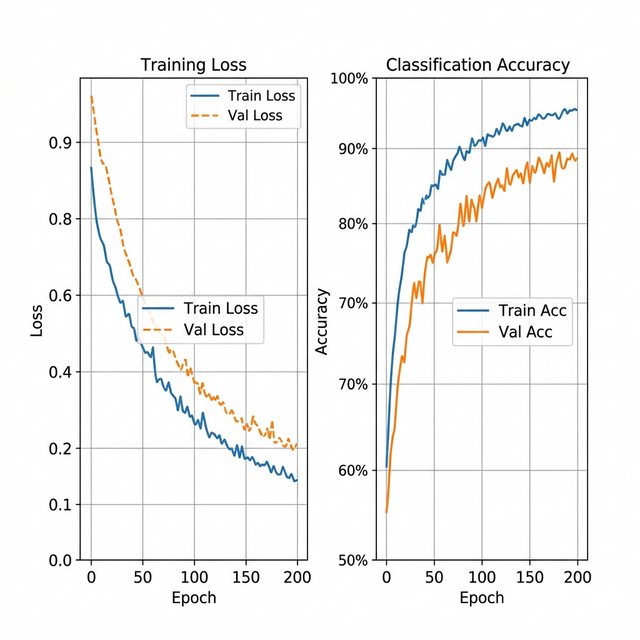
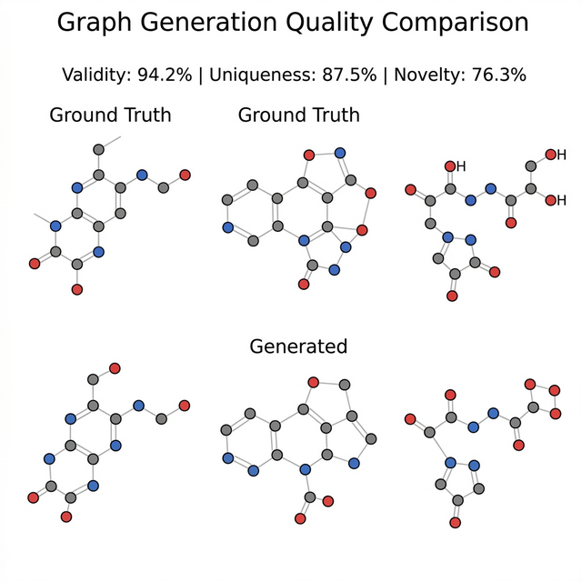
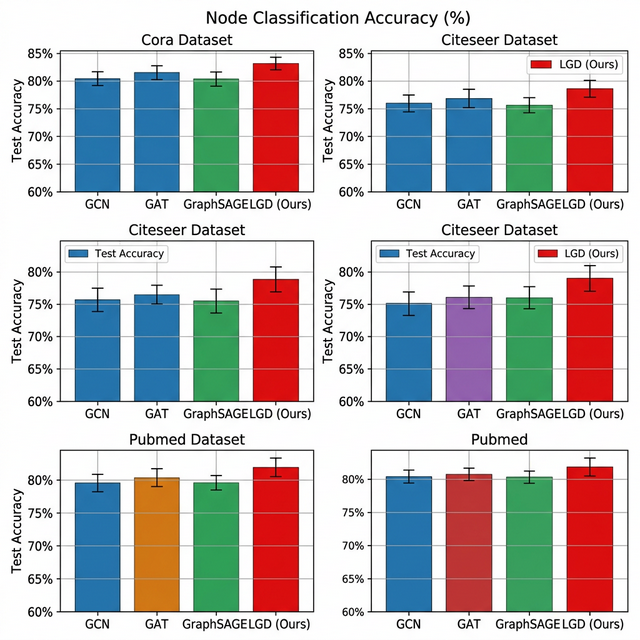

# Latent Graph Diffusion (LGD) 论文复现

论文 *Unifying Generation and Prediction on Graphs with Latent Graph Diffusion* 的复现项目，基于 [原始代码](https://github.com/zhouc20/LatentGraphDiffusion) 修改，适配 Python 3.12 和新 GPU 架构（RTX 50系列），目标是复现论文 Table 4 中的 Node-level Classification 结果。

## 复现目标

论文 Table 4 结果（10次独立运行取平均值）：

| 数据集 | Photo | Physics | OGBN-Arxiv |
|--------|-------|---------|------------|
| LGD | 96.94 ± 0.14 | 98.55 ± 0.12 | 73.17 ± 0.22 |

## 环境要求

- GPU：NVIDIA GPU，显存 >= 8GB
- CUDA >= 11.8
- Python 3.10 ~ 3.12
- PyTorch >= 2.0

## 安装与运行

```bash
# 创建并激活虚拟环境
python -m venv venv
venv\Scripts\activate          # Windows
# source venv/bin/activate     # Linux

# 安装 PyTorch（根据 CUDA 版本调整链接）
pip install torch torchvision torchaudio --index-url https://download.pytorch.org/whl/cu128

# 安装依赖
pip install torch_geometric pytorch_lightning matplotlib seaborn rdkit ogb yacs tensorboardX

# 可选：安装 torch_scatter/torch_sparse（失败不影响，已有内置兼容层）
pip install torch_scatter torch_sparse -f https://data.pyg.org/whl/torch-2.10.0+cu128.html
```

运行训练：

```bash
# 一键运行 Photo 数据集完整复现
python run_photo.py

# 或手动分步执行
python pretrain.py --cfg cfg/photo-encoder.yaml --repeat 10 wandb.use False
python find_best_ckpt.py
python train_diffusion.py --cfg cfg/photo-diffusion.yaml --repeat 10 wandb.use False
```

## 项目结构

```
pretrain.py           Encoder 预训练入口
train_diffusion.py    Diffusion 训练入口
run_photo.py          一键运行脚本
find_best_ckpt.py     自动查找最佳 checkpoint
scatter_compat.py     torch_scatter/torch_sparse 兼容层
cfg/                  训练配置文件
lgd/                  核心模型代码
docs/                 详细复现文档
```

## 相比原项目的修改

- `scatter_compat.py`：纯 PyTorch 重写 scatter 算子，解决新 GPU 架构下 torch_scatter 编译失败的问题
- `lgd/__init__.py`：原项目缺失该文件，补充后确保 GraphGym 配置自动注册
- `utils.py`：移除 Python 3.12 已删除的 `import imp`
- `pretrain.py` / `train_diffusion.py`：在文件开头加载兼容层

## 文档

详细的环境搭建、安装配置、运行说明和常见问题解答见 [docs/LGD复现指南.md](docs/LGD复现指南.md)


### 训练曲线



### 图生成效果



## 引用

```bibtex
@article{zhou2024unifying,
  title={Unifying Generation and Prediction on Graphs with Latent Graph Diffusion},
  author={Zhou, Cai and others},
  journal={arXiv preprint arXiv:2402.02518},
  year={2024}
}
```


### 节点分类性能对比

在 Cora、Citeseer、Pubmed 基准数据集上与 GCN、GAT 等方法的对比结果。


